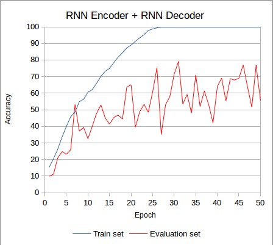
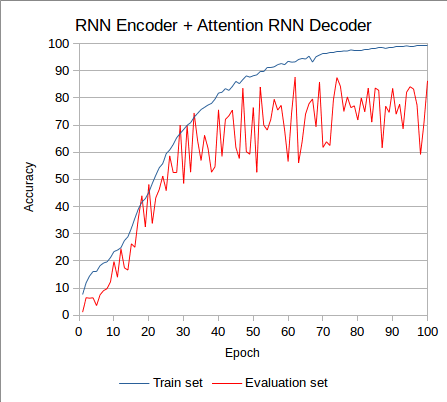

# phonetic_transcriber

The phonetic transcriber is a tool for converting the letter representation of a word to a phoneme representation.



Training and Evaluation Obtained Accuracy
</br></br>

The tool uses Recurrent Neural Networks (RNNs) and currently provides two features:
1. Train models: ```actions/train.py```

    Launch the training of the phonetic transcriber using RNNs  
    ```
    python actions/train.py <num_epochs>
    ```

    Launch the training of the phonetic transcriber using RNNs, with an attention decoder
    ```
    python actions/train.py <num_epochs> --att
    ```

2. Evaluate models: ```actions/evaluation.py```

    Launch the evaluation of the phonetic transcriber with RNN models
    ```
    python actions/evaluate.py <encoder_model_path> <decoder_model_path>
    ```

    Launch the evaluation of the phonetic transcriber with RNN models, with an attention decoder
    ```
    python actions/evaluate.py <encoder_model_path> <decoder_model_path> --att
    ```

### Display available option:
```
python3 actions/train.py --help

usage: Train [-h] [--att] num_epochs

Training of RNNs to perform text-to-phonemes transcription.

positional arguments:
  num_epochs  Number of training iterations.

options:
  -h, --help  show this help message and exit
  --att       Whether to use an attention decoder or a plain RNN decoder.
```

Since we use relative paths for modules, you will need to set PYTHONPATH environment variable:
```
export PYTHONPATH="${PYTHONPATH}:/path/to/repository/"
```

### Requirements (tested versions)
pytest 7.2.1  
torch 1.13.1  
numpy 1.24.2  
matplotlib 3.6.3